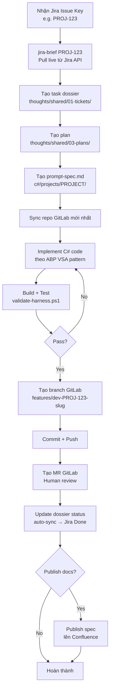

# Workflows Tích Hợp — Confluence + Jira + GitLab + Harness

Tài liệu này mô tả các luồng làm việc end-to-end liên nền tảng và brainstorm
các tính năng mở rộng phù hợp với `harness_coding_framework`.

---

## Luồng 1: Từ Jira ticket → Code → MR

Luồng phổ biến nhất. Nhận Jira issue key, AI tự động thực hiện toàn bộ.



---

## Luồng 2: Từ intent → Jira ticket → Brief → Code

Bắt đầu từ ý tưởng tự nhiên, AI tạo ticket trên Jira rồi thực hiện.

```
1. Agent nhận intent: "Thêm tính năng xuất báo cáo VNPay theo ngày"
2. [Jira] jira-create "<intent>" --project-key PAYMENT
   → Tạo Epic + Story + Sub-tasks
3. [Jira] jira-brief <STORY-KEY>
   → Tổng hợp context đầy đủ
4. [Harness] Tạo ticket + plan trong thoughts/
5. [GitLab] Tạo branch + implement + MR
```

---

## Luồng 3: Publish tài liệu AI-generated lên Confluence

Dành cho requirements/design docs được AI sinh ra.

```
1. [Harness] rde-requirements "Mô tả nghiệp vụ..." --publish --space DEV
2. [Harness] rde-design requirements.md --publish --space DEV
3. [Jira] add_remote_link(PROJ-123, confluence_url, "Specs")
4. [Harness] Ghi confluence_url vào dossier/impact.md
```

---

## Luồng 4: Roadmap → Jira Epics + Confluence pages

Dành cho quản lý sản phẩm, publish roadmap module lên cả hai nền tảng.

```bash
# Publish roadmap.md lên Confluence + tạo Epic/Story trên Jira
python scripts/publish_roadmap_to_jira_confluence.py

# Chỉ publish Confluence (đã có Jira)
python scripts/publish_roadmap_to_jira_confluence.py --skip-jira

# Chỉ cập nhật Jira (đã có Confluence)
python scripts/publish_roadmap_to_jira_confluence.py --skip-confluence

# Dry run
python scripts/publish_roadmap_to_jira_confluence.py --dry-run
```

---

## Brainstorm — Tính Năng Mở Rộng

Các tính năng chưa có trong harness hiện tại, được brainstorm từ ict-ai-context-engine
và các nhu cầu thực tế của FPT SDLC.

### 🔴 Ưu tiên cao (Quick wins)

#### 1. Jira-Brief Script (`scripts/jira_brief.ps1`)

PowerShell wrapper để agent (Antigravity, Cursor...) gọi nhanh brief từ Jira ticket:

```powershell
# Sử dụng
.\scripts\jira_brief.ps1 -IssueKey "PAYMENT-123"
.\scripts\jira_brief.ps1 -IssueKey "OMS-456" -Collection knowledge -TopK 10
```

Tích hợp vào harness workflow: agent gọi script này để lấy context
trước khi bắt đầu bất kỳ task C# nào có Jira key.

#### 2. Confluence Template Library (`integrations/confluence-templates/`)

Thư viện template Markdown chuẩn cho các loại tài liệu phổ biến:

- `feature-spec.md` — Feature specification template
- `architecture-decision-record.md` — ADR template
- `api-design.md` — OpenAPI spec template
- `runbook.md` — Operational runbook template
- `post-mortem.md` — Incident post-mortem template

Khi agent cần publish lên Confluence → sử dụng template phù hợp.

#### 3. GitLab MR Description Template

Template chuẩn cho MR description, tự động populate từ task dossier:

```markdown
## 📋 Jira Ticket
[{ISSUE_KEY}]({JIRA_URL}/browse/{ISSUE_KEY}) — {SUMMARY}

## 🎯 Mục đích
{INTENT_OR_PLAN}

## 📝 Thay đổi
{SCOPE_FROM_DOSSIER}

## ✅ Checklist
- [ ] Unit tests pass
- [ ] Integration tests pass
- [ ] validate-harness.ps1 pass
- [ ] Không có TODO/NotImplementedException
- [ ] Feature manifest updated
```

#### 4. Auto-update feature-manifest.json từ Jira

Khi tạo/cập nhật Jira ticket → tự động cập nhật `feature-manifest.json`:

```json
{
  "jira_issue_key": "PAYMENT-123",
  "jira_status": "In Progress",
  "jira_story_points": 5,
  "jira_sprint": "Sprint 42",
  "ai_status": "in-progress"
}
```

---

### 🟡 Ưu tiên trung bình

#### 5. Confluence Space Mapper (`integrations/space-map.json`)

Bảng ánh xạ project → Confluence space key:

```json
{
  "payment-hub": "PAYMENT",
  "oms": "OMS",
  "default": "DEV"
}
```

Agent tra cứu bảng này thay vì đoán space key.

#### 6. Jira Sprint Context trong Task Brief

Khi sinh task brief, bổ sung thêm context sprint hiện tại:
- Sprint goal
- Các ticket cùng sprint
- Sprint deadline
- Velocity của team

#### 7. GitLab Pipeline Status Reader

Sau khi push MR, agent monitor CI pipeline:

```powershell
# Kiểm tra pipeline status
python -m app.cli gitlab-pipeline-status --mr-url <MR_URL>
```

Nếu pipeline fail → lấy log lỗi → AI phân tích → đề xuất fix.

#### 8. Confluence Diff Sync

Khi design doc thay đổi → chỉ update phần đã thay đổi trên Confluence,
không overwrite toàn bộ page (giữ lại comment của reviewer).

---

### 🟢 Ưu tiên thấp / Dài hạn

#### 9. Bi-directional Sync: Confluence → Harness

Khi BA/PM cập nhật spec trên Confluence → tự động:
1. Pull nội dung mới về harness
2. Diff với spec cũ
3. Tạo Jira ticket cho các thay đổi
4. Notify dev qua Jira comment

#### 10. Jira Worklog Automation

Sau khi hoàn thành task dossier → tự động log thời gian làm việc vào Jira:

```python
jira.add_worklog(
    issue_key="PROJ-123",
    time_spent="3h",
    comment="Implemented VNPay callback handler",
)
```

#### 11. Cross-project Impact Analysis

Khi thay đổi một service → query ChromaDB để tìm các service/module khác
có dependency (qua API contract, shared DB, events) → tạo Jira tickets
cho các team liên quan.

#### 12. Confluence Knowledge Base Agent

Agent thường xuyên quét Confluence để:
- Phát hiện tài liệu outdated (so với code)
- Đề xuất cập nhật
- Flag các trang có mâu thuẫn với nhau

#### 13. Jira Velocity Dashboard → Confluence

Tự động publish báo cáo velocity, burndown chart của sprint
lên Confluence sau khi sprint kết thúc.

#### 14. GitLab Code Review Assistant

Agent đọc MR diff → kiểm tra theo harness rules → tự động add comments:
- Vi phạm naming convention
- Thiếu unit test
- NotImplementedException còn sót
- Feature manifest chưa cập nhật

---

## Phân chia triển khai

| Phase | Tính năng | Effort |
|---|---|---|
| **P1 (Sprint hiện tại)** | Jira-Brief Script, Confluence Template Library, MR Description Template | 3 ngày |
| **P2** | Auto-update feature-manifest, Space Mapper, Sprint Context | 1 tuần |
| **P3** | GitLab Pipeline Status, Confluence Diff Sync, Worklog Automation | 2 tuần |
| **P4 (Dài hạn)** | Bi-directional Sync, Cross-project Impact, Knowledge Base Agent | 1+ tháng |
